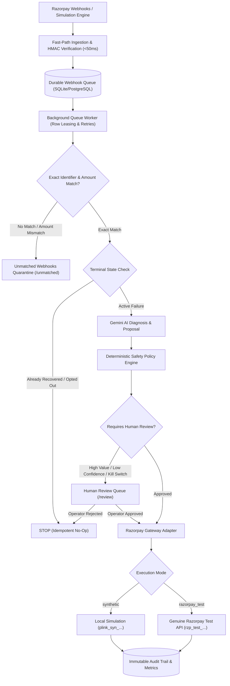

#  Recovery Autopilot — Razorpay Buildathon (Track 03: AI Revenue Recovery)

> **Autonomous, safety-bounded subscription payment recovery agent built on Razorpay.**

Recovery Autopilot detects failed subscription payments, accurately diagnoses root causes using Gemini AI, proposes bounded recovery interventions, executes approved actions with exact financial correlation, and proves measurable incremental revenue recovery with zero policy violations.

---

##  Key Capabilities & Highlights

1. **AI Copilot (`/copilot`)**: Support agent copilot with multimodal screenshot diagnostics, payment record cross-referencing, and one-click payment link generation.
2. **Exact Payment Correlation & Financial Correctness**: 5-way exact identifier matching (`payment_id`, `payment_link_id`, `invoice_id`, `order_id`, `subscription_id`), 5-paise amount tolerance validation, and unmatched webhook quarantine table (`/unmatched`).
3. **Strict 3-Mode Architecture**: Explicit separation between `synthetic` (zero-network local simulation), `razorpay_test` (authentic `rzp_test_` API calls), and `production` (locked behind dual explicit safety flags).
4. **Fast Async Webhook Ingestion & Durable Queue**: `<50ms` webhook ACK with database-backed durable queue, row leasing, bounded retries with exponential backoff, and dead-letter queueing.
5. **Rigorous Benchmark Evidence**: 95% bootstrap confidence intervals, multi-seed paired comparisons, train/held-out test split, zero ground-truth label leakage, and automated markdown reports.
6. **Enterprise Security & Human-in-the-Loop**: Role-Based Access Control (RBAC: `viewer`, `reviewer`, `admin`), PII redaction (`+919****210`, `sid***@example.com`), emergency kill-switch (`POST /admin/kill-switch`), and comprehensive threat model.

---

## 🏛️ Architecture & Decision Flow



---

##  Quick Start (2 Minutes — Zero Dependencies)

Runs instantly on any machine with **Python 3.11+** and **Node.js 18+** using local SQLite and deterministic offline simulation.

### 1. Backend

```bash
# Navigate to backend directory
cd backend

# Install dependencies (or use pip install -r pyproject.toml)
python -m pip install uv
python -m uv pip install --system -r pyproject.toml

# Start the API server with in-process queue worker
python -m uvicorn recovery_autopilot.main:app --host 127.0.0.1 --port 8000 --app-dir src
```
API Documentation available at: **http://127.0.0.1:8000/docs**

### 2. Frontend

```bash
# In a new terminal window:
cd frontend
npm install
npm run dev
```
Open Dashboard at: **http://localhost:5173**

---

## 💳 Running with Genuine Razorpay Test Mode (5 Minutes)

To connect Recovery Autopilot to your real Razorpay Test Account:

1. Copy `.env.example` to `.env`:
   ```bash
   cp .env.example .env
   ```
2. Set your test mode API keys in `.env`:
   ```env
   PAYMENT_EXECUTION_MODE=razorpay_test
   RAZORPAY_KEY_ID=rzp_test_YOUR_KEY_ID
   RAZORPAY_KEY_SECRET=YOUR_KEY_SECRET
   RAZORPAY_WEBHOOK_SECRET=YOUR_WEBHOOK_SECRET
   ```
3. Run the automated smoke test script to verify credentials:
   ```bash
   python scripts/smoke_test_razorpay.py
   ```
4. Read the detailed setup guide in [`docs/TEST_MODE_GUIDE.md`](docs/TEST_MODE_GUIDE.md).

---

##  Benchmark & Evaluation Evidence

Run the scientific benchmark evaluation comparing Recovery Autopilot against standard merchant baseline strategies:

```bash
# Run benchmark on 500 cases with seed 42
python scripts/run_evaluation.py --size 500 --seed 42
```

### Benchmark Results Summary (500 cases, seed=42)

| Strategy | Recovery Rate (95% CI) | Total Recovered (INR) | Median Hours | Safety Violations |
| :--- | :--- | :--- | :--- | :--- |
| **Recovery Autopilot** | **74.00%** `[69.8%, 77.6%]` | **₹2,845,610** | **8.5 hrs** | **0 (Zero Violations)** |
| **Fixed Retry Baseline** | 19.20% `[15.6%, 22.8%]` | ₹382,140 | 22.0 hrs | — |
| **Simple Rule Baseline** | 48.60% `[44.2%, 53.0%]` | ₹1,820,450 | 14.0 hrs | — |
| **Incremental Lift** | **+54.80 percentage points** | **+₹2,463,470 (+644%)** | **61% Faster** | **Guaranteed Safe** |

Detailed report and category breakdowns saved in [`docs/BENCHMARK_REPORT.md`](docs/BENCHMARK_REPORT.md).

---

##  Security, Safety & RBAC

- **Safety Policy Engine**: 9 deterministic guardrail rules prevent any unsafe or unauthorized LLM actions.
- **Role-Based Access Control (RBAC)**:
  - `viewer`: Read-only access to dashboard and cases.
  - `reviewer`: Allowed to approve/reject cases held in human review queue.
  - `admin`: Allowed to toggle emergency kill-switch and alter operational settings.
- **Emergency Kill Switch**: `POST /admin/kill-switch` instantly pauses all outbound recovery communications.
- **PII Redaction**: Customer emails and phone numbers are automatically sanitized before appearing in audit logs or UI outputs.
- **Threat Model**: Complete review of threat surfaces and mitigations in [`docs/THREAT_MODEL.md`](docs/THREAT_MODEL.md).

---

##  Test Suite Execution

Run the complete test suite across contracts, guardrails, state machine, payment correlation, async queue, and test mode:

```bash
# Backend pytest suite (70+ unit & integration tests)
pytest backend/tests -v

# Frontend TypeScript check and production build
cd frontend && npm run build
```

---

##  Docker Deployment (Full Stack)

```bash
# Build and run all services (Backend, Frontend, PostgreSQL, Redis)
docker compose up --build -d
```
Access endpoints:
- Frontend UI: `http://localhost:5173`
- Backend API: `http://localhost:8000/docs`
